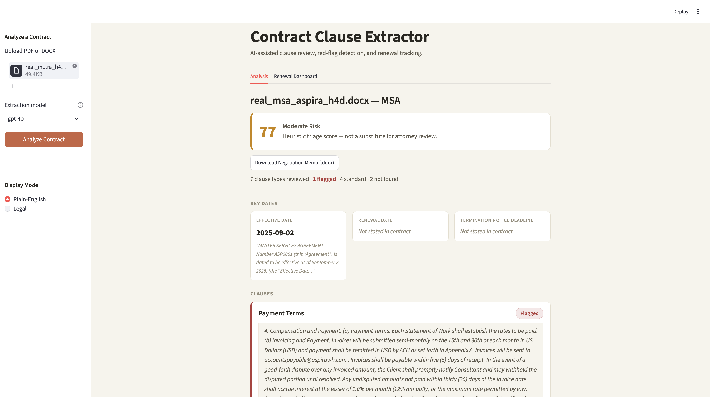
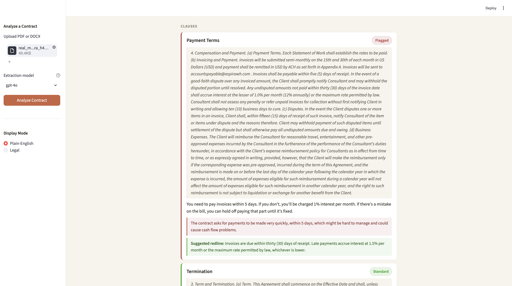
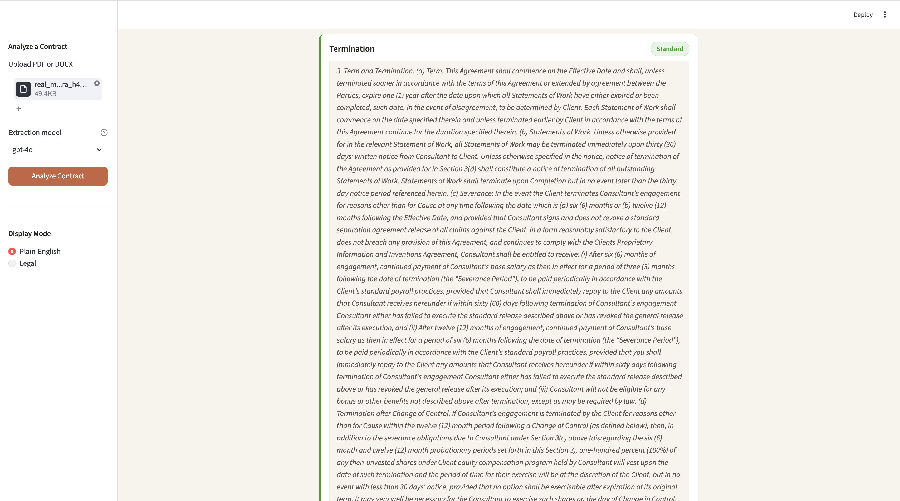
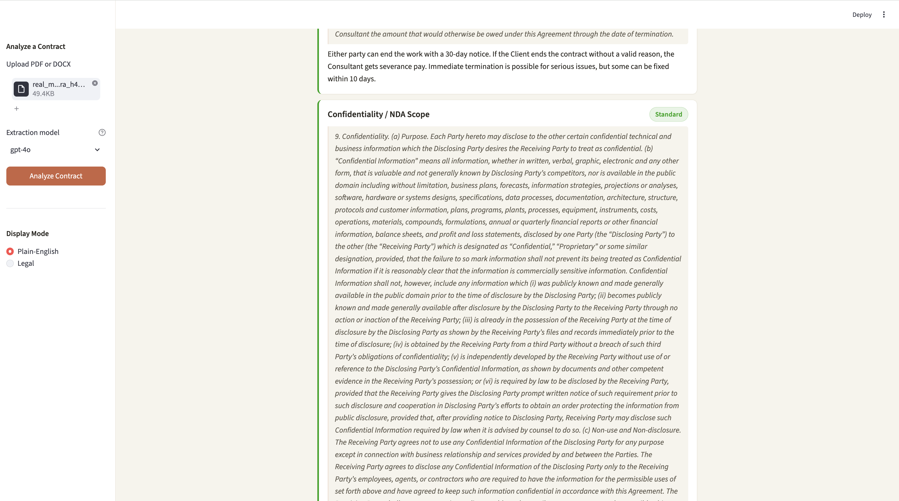
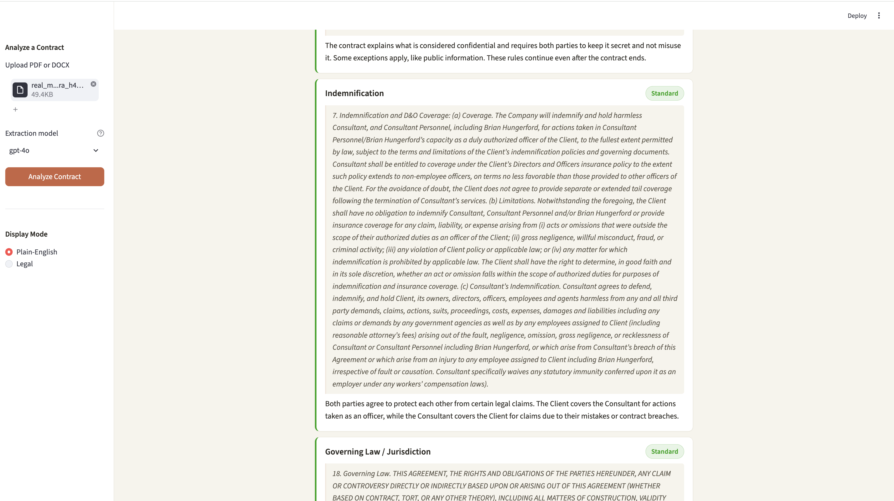
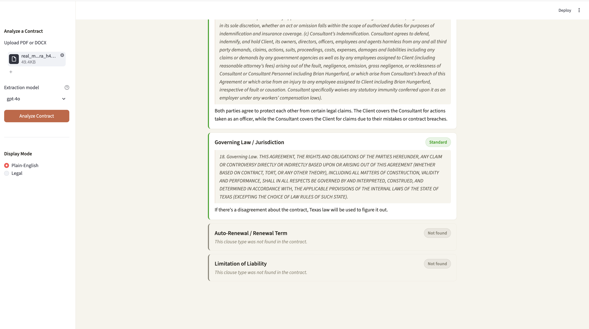
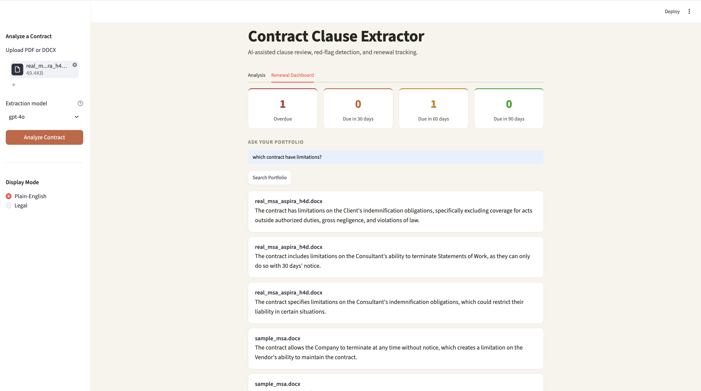
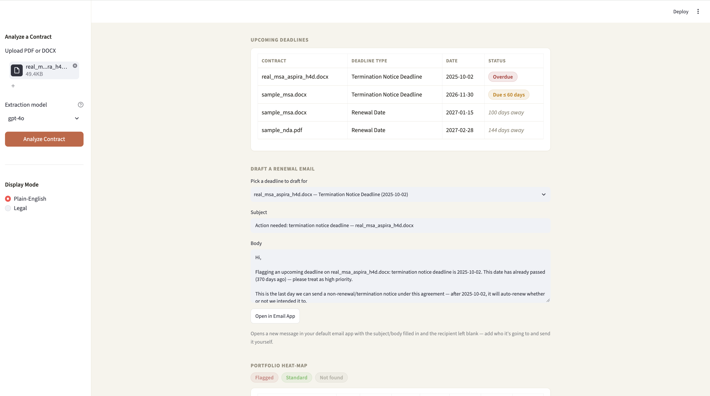
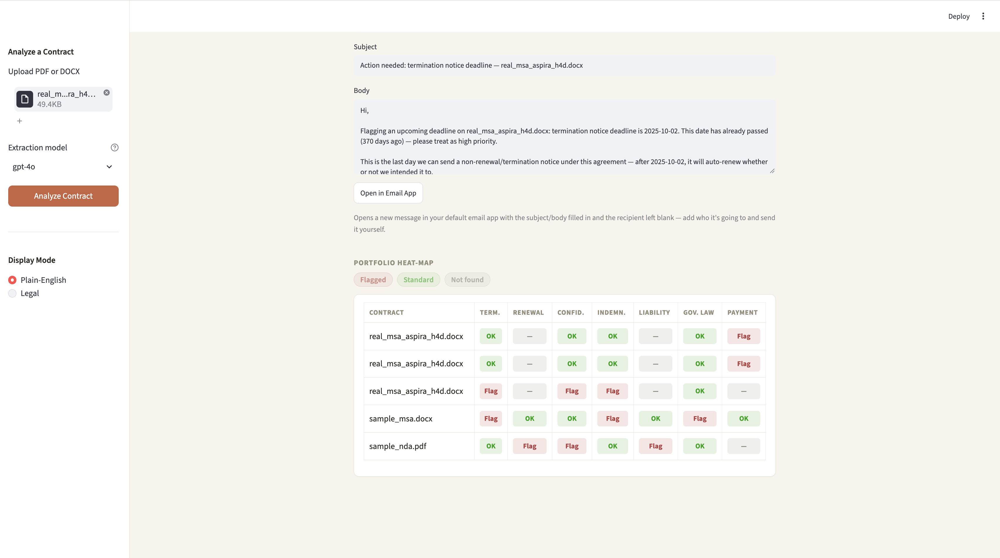

# Contract Clause Extractor & Risk/Renewal Tracker

AI-assisted contract review: upload an NDA or MSA, extract and verify key clauses
against a legal playbook, flag red flags with suggested fixes, track renewal
deadlines, and query your whole contract portfolio in plain English.



## What it does

- **Extracts 7 standard clause types** — termination, auto-renewal, confidentiality,
  indemnification, limitation of liability, governing law, payment terms
- **Checks every clause against a playbook** of acceptable vs. risky language, and
  flags deviations with a plain-English reason
- **Strict grounding** — every quoted clause is independently verified against the
  source document's actual text. If a quote can't be verified verbatim, it's
  discarded and reported as "not found" rather than risking a fabricated quote
- **Suggested redlines** — for every flagged clause, drafts a replacement clause
  adapted from the playbook's acceptable-language example
- **Lawyer / Plain-English toggle** — the same analysis rendered two ways: precise
  legal language for counsel, or plain English for a client with no legal background
- **One-click negotiation memo** — exports a Word document with the risk score,
  flagged issues, and suggested redlines
- **Contract Risk Score** — a heuristic 0–100 triage score, not a substitute for
  attorney review
- **Renewal dashboard** — tracks every uploaded contract's renewal/termination
  deadlines, bucketed by urgency (overdue / 30 / 60 / 90 days)
- **Ask Your Portfolio** — natural-language search across every saved contract
  (e.g. "which contracts have no limitation of liability clause?")
- **Portfolio heat-map** — every contract against every clause type, color-coded
  at a glance
- **Auto-drafted renewal emails** — one click opens a pre-filled draft in your own
  email client (a human still reviews and sends — the app never sends on its own)

## Screenshots

| | |
|---|---|
|  |  |
|  |  |
|  |  |
|  |  |

## Why this exists

Built to demonstrate a real decision every client-facing legal-AI tool runs into:
**cost vs. trust in model choice.** The extraction model is switchable live in the
sidebar. Testing on a real contract (see below) found that `gpt-4o-mini` missed a
genuine red flag (a vague auto-renewal clause with no notice window) across 5
repeated runs, while `gpt-4o` caught it every time. Same code, same contract — only
the model changed. That tradeoff is the point of the toggle, not a bug to be
papered over.

## Tested on a real contract, not just synthetic examples

In addition to two synthetic sample contracts (`sample_nda.pdf`, `sample_msa.docx`),
this was tested against a real Master Services Agreement pulled from a public SEC
EDGAR filing (`real_msa_aspira_h4d.docx` — Aspira Women's Health, Inc. / H4D
Consulting, filed 2025-09-03, [source](https://www.sec.gov/Archives/edgar/data/926617/000164117225026441/ex10-1.htm)).
Running on a real, messily-formatted filing surfaced a genuine issue — SEC filings
repeat the document title as a running page header, which was breaking verbatim
clause grounding when a real clause spanned across one of those headers. Fixed in
`parser.py` by stripping short lines that repeat 3+ times across the document
before the text ever reaches the model.

## Tech stack

- **Streamlit** — UI
- **OpenAI API** (`gpt-4o` / `gpt-4o-mini`) — clause extraction via structured
  outputs (JSON schema), with independent grounding verification against source text
- **pdfplumber** / **python-docx** — PDF/DOCX text extraction
- **python-docx** — negotiation memo generation

## Project structure

```
app.py                  Streamlit UI
extractor.py             Clause extraction + grounding verification
parser.py                PDF/DOCX text extraction + header-stripping
dashboard.py              Renewal/termination date bucketing
risk_score.py             Heuristic risk scoring
memo.py                   Word memo generation
renewal_email.py           Renewal email drafting
portfolio_filter.py        Natural-language portfolio search
storage.py                 Run persistence
labels.py                  Shared display labels/colors
contract_playbook.json     Reference acceptable/risky language per clause type
sample_contracts/          Synthetic + real sample contracts for testing
```

## Running locally

```bash
python3 -m venv venv
source venv/bin/activate
pip install -r requirements.txt

# add your OpenAI key
echo "OPENAI_API_KEY=sk-..." > .env

streamlit run app.py
```

## Disclaimer

This is a drafting/triage aid, not legal advice. The risk score and suggested
redlines are heuristic and AI-generated — always have a qualified attorney review
flagged clauses and any language before relying on it.
